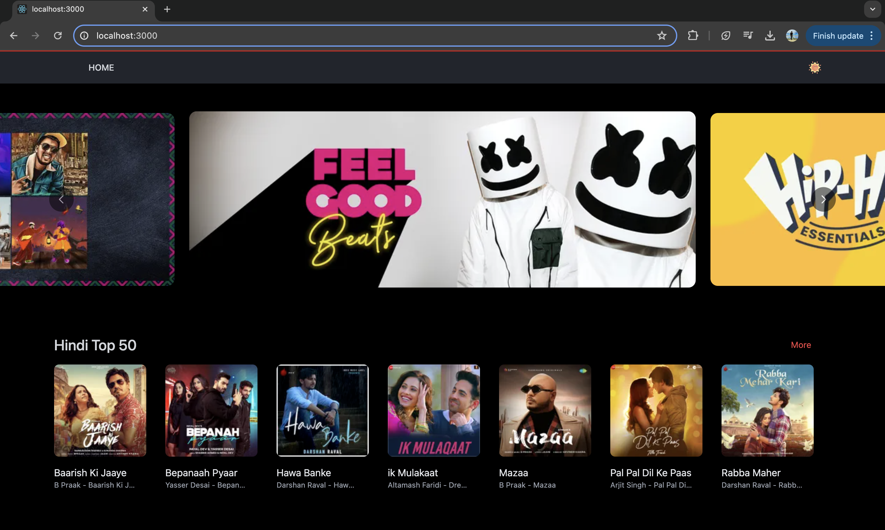
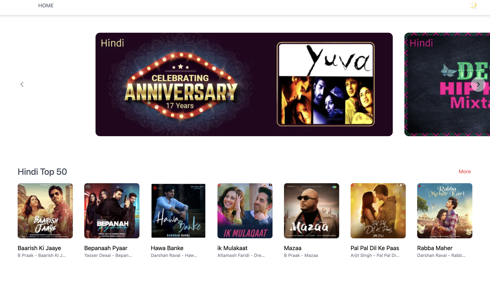
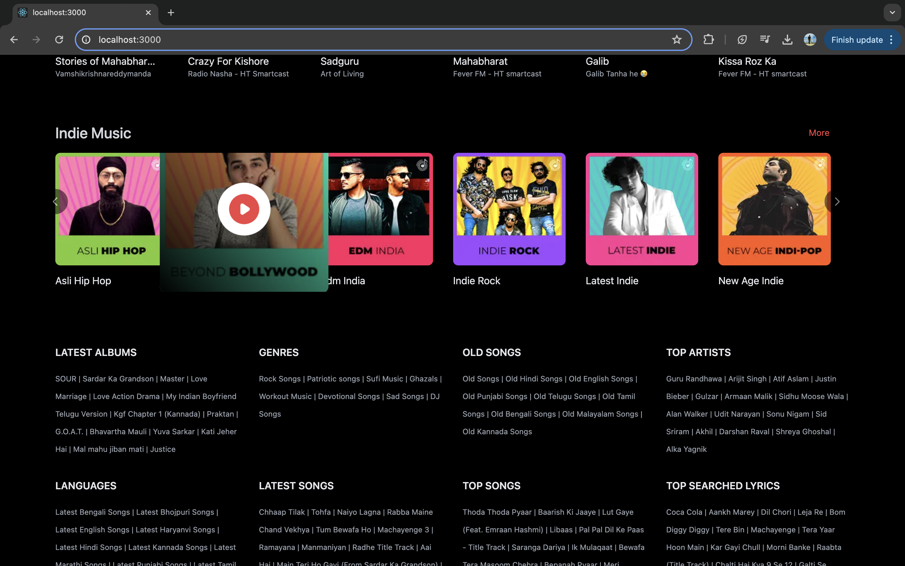
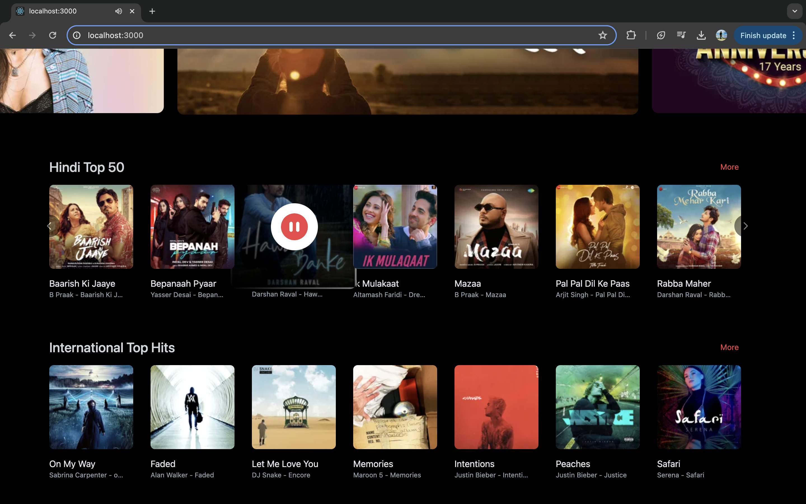

# Deployed on GH-pages
https://shubham3030.github.io/trajactor-FE-assignment/#

# Music Player - SongBook

This is a music player built with React, tailwind and TypeScript. It allows you to play, pause, and skip through a selection of songs.

## Features

- **Playback Features**
  - Play/Pause functionality
  - Highlighting of currently playing song
  - Click event on song cards to perform specific actions
  - Added a dummy song for play due to unavailability of backend server and AWS creds to upload audio files

- **UI/UX Features**
  - Banners for trending music
  - Hover effect on song cards
  - Support for dark and light theme

- **Backend and Data Handling**
  - Created a mock server using Postman and created dummy API's to fetch metadata for songs
  - Handled fallback case: if the API fails to load data, default data will be rendered

- **Testing**
  - E2E Unit tests for the components

## Installation

To install the project, follow these steps:

1. Clone the repository: `git clone https://github.com/shubham3030/trajactor-FE-assignment.git`
3. Install the dependencies: `npm install`
4. Start the project: `npm run start:dev`

## Usage

To use the music player, simply click on a song card. The song will start playing and the card will be highlighted. You can pause the song by clicking the pause button, and you can skip to the next song by clicking the next button.

## Github Repo URL
https://github.com/shubham3030/trajactor-FE-assignment.git

## Bonus Points Covered -
  - Ingestion of sample API/s using Postman Mock servers.
  - Smart traversal of API returns.
  - Modular code summing up to a whole.
  - Some minimal Unit test cases. Can be extended easily.
  - Proper code formats and comments.
  - Easily extensible to add more features (eg: Search Music/Artist/podcast)

## Screen Shots
- Dark Theme

- Light Theme

- Hover Effect && Play/ Pause

